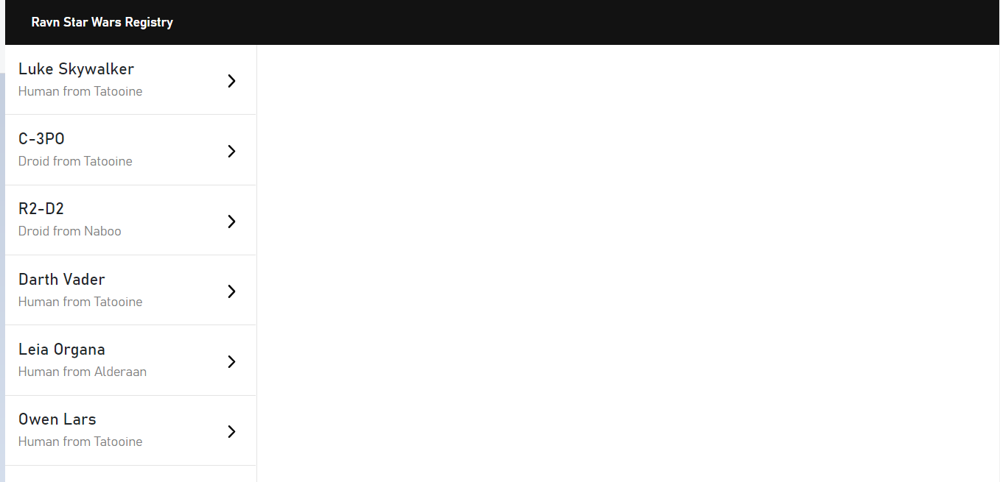

<!-- PROJECT LOGO -->
<br />
<p align="center">
  <a href="https://github.com/AckerCoder/Ravn-Challenge-V2-Miguel-Zegarra">
    
  </a>

  <h3 align="center">Hi! This is a challenge made by Miguel Zegarra for Ravn</h3>

  <p align="center">
    The challenge was about of building an app with GraphQL, Apollo and other optional technolgies. The app is a Star Wars Character Registry powered by https://swapi-graphql.netlify.app/ I have chossen ReactJS for a bunch reasons, but the most important is because it's very simple to compile and do some changes while you are working with an API.
    <br />
    <br />
    <br />
  </p>
</p>


<!-- TABLE OF CONTENTS -->
## Table of Contents

* [About the Project](#about-the-project)
  * [Built With](#built-with)
* [Getting Started](#getting-started)
  * [Prerequisites](#prerequisites)
  * [Installation](#installation)
* [Usage](#usage)


<!-- ABOUT THE PROJECT -->
## About The Project

Here's a blank template to get started:
**To avoid retyping too much info. Do a search and replace with your text editor for the following:**
`AckerCoder`, `Ravn-Challenge-V2-Miguel-Zegarra`, `twitter_handle`, `armando.zegarra@ucsp.edu.pe`


### Built With

* [ReactJS](https://reactjs.org/)
* [Apollo Client](https://www.apollographql.com/)
* [GraphQL](https://graphql.org/)


<!-- GETTING STARTED -->
## Getting Started

To get a local copy up and running follow these simple steps.

### Prerequisites
1. You must have npm installed and the npm packages that are listed on the installation section.

### Installation

1. Clone the repo
```sh
git clone https://github.com/AckerCoder/Ravn-Challenge-V2-Miguel-Zegarra.git
```
2. Install NPM packages
```sh
npm install react @apollo/react-hooks apollo-boost graphql graphql-tag normalize.css react-apollo react-bootstrap
```


<!-- USAGE EXAMPLES -->
## Usage

1.- When we open the web app and everything goes fine with the API, we will see an screen like this in out desktop computer or laptop.

2.- We can click in the character that we want to display information

3.- This little program is powered by an awesome third party; therefore, if we see a messa like this one is because of the API was deprecated or it's in maintenance.


<!-- CONTACT -->
## Contact

Miguel Zegarra  - ackercoder@gmail.com

